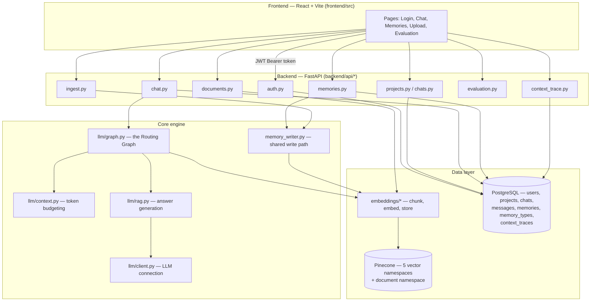
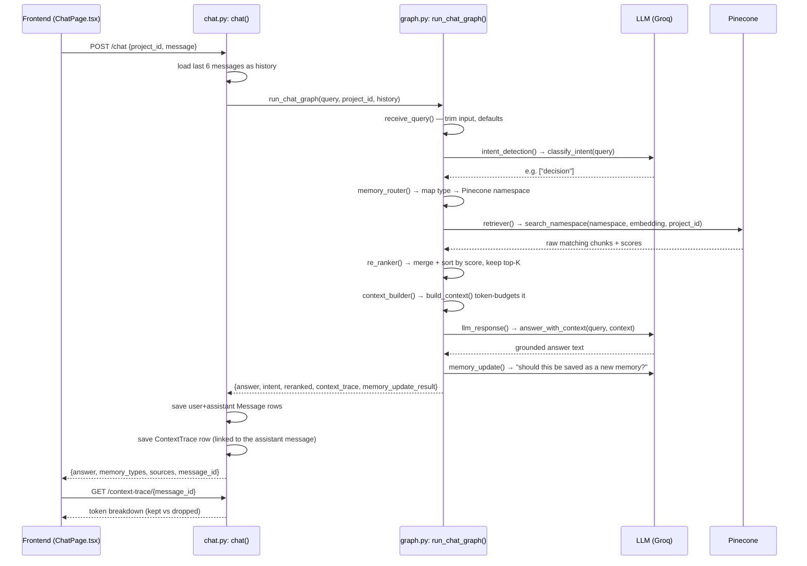
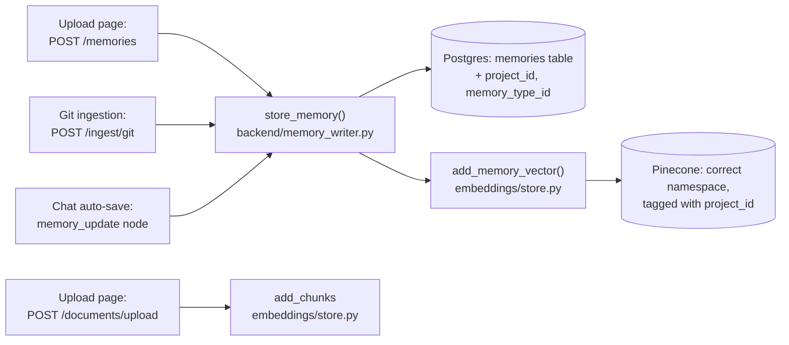
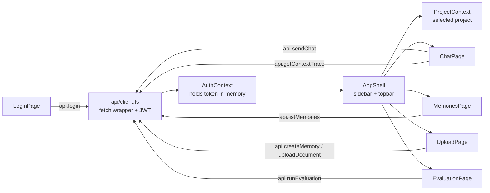

# MemoryRAG — Architecture & Function Flow

This document explains how the whole application works, end to end: every
directory, what each function does, who calls whom, and which functions are
the **real engine** of the product versus supporting plumbing. It's written so
you can both use it as a working reference and read the first two sections
aloud to a manager in five minutes.

---

## 1. The 60-second explanation (for your manager)

> "Most AI chat tools dump all your documents into one search index and hope
> for the best. MemoryRAG instead splits knowledge into **five typed
> memories** — Documents, Code, Decisions, Workflows, Conversations. When a
> user asks a question, an LLM first **classifies the question's intent**
> (which memory type does this need?), then we search **only** that memory,
> assemble a **token-budgeted** context (so we don't blow the prompt limit),
> and generate a grounded answer. Every answer is **explainable**: the UI
> shows which memory was picked, what was retrieved, and exactly what was
> kept vs. dropped from the context. Everything is also **project-scoped** —
> each project's memories are fully isolated from every other project's."

The one diagram that matters:

```
User question
     │
     ▼
Intent classifier (LLM)  ──►  "this is a Decision question"
     │
     ▼
Router  ──►  search ONLY the Decision memory (Pinecone namespace)
     │
     ▼
Re-rank + token-budget the retrieved chunks
     │
     ▼
LLM generates the answer, grounded in that context
     │
     ▼
Answer + routing badge + sources + token receipt shown in the UI
```

That whole pipeline is one LangGraph "graph" (`backend/llm/graph.py`), and it
is the single most important piece of code in the system.

---

## 2. System map



**Two data stores, two jobs:**
- **PostgreSQL** — structured records: who the users are, what projects/chats
  exist, the raw text of every memory, and the audit trail (messages, context
  traces).
- **Pinecone** (vector database) — the *searchable* form of that same
  knowledge: every memory/document chunk turned into a 384-number embedding,
  organized into 5 "namespaces" (one per memory type) so a search can be
  aimed at exactly one type.

---

## 3. The core flow, traced function-by-function

This is **the** flow to understand — everything else in the app supports it.
It's what happens the instant a user hits "Send" in the Chat page.



### Function-by-function narration of that diagram

| # | Function | File | What it does | Key arguments |
|---|---|---|---|---|
| 1 | `chat()` | `backend/api/chat.py` | The HTTP entry point. Loads recent chat history for the project, calls the graph, logs both messages, saves the context trace, shapes the HTTP response. | `payload: ChatRequest {project_id, message, top_k}` |
| 2 | **`run_chat_graph()`** | `backend/llm/graph.py` | Invokes the compiled LangGraph state machine with the initial state. This is the **one function that runs the entire routing pipeline**. | `query`, `project_id`, `final_top_k`, `history` |
| 3 | `receive_query()` | `backend/llm/graph.py` | Graph node 1. Trims whitespace, fills in the default `final_top_k`. Trivial but always runs first. | `state: GraphState` |
| 4 | **`intent_detection()` → `classify_intent()`** | `backend/llm/graph.py` | Graph node 2. Sends the question to the LLM with a classifier prompt, asking it to pick 1+ of the 5 memory types. **This is the "Adaptive" in Adaptive Memory Routing** — the decision everything else depends on. | `query`, `version` (which prompt file to use, v1/v2) |
| 5 | `memory_router()` | `backend/llm/graph.py` | Graph node 3. Pure lookup: turns `["decision"]` into `["decision_memory"]` (the Pinecone namespace name), via the `MEMORY_NAMESPACES` dict. | `state["intent"]` |
| 6 | **`retriever()` → `search_namespace()`** | `graph.py` / `embeddings/store.py` | Graph node 4. Embeds the query, then searches **only** the chosen namespace(s), filtered to the current `project_id`. This is where project isolation and type isolation both get enforced. | `namespace`, `query_embedding`, `top_k`, `project_id` |
| 7 | `re_ranker()` | `backend/llm/graph.py` | Graph node 5. If more than one memory type was searched, merges all hits and sorts by similarity score, keeps the best `final_top_k`. | `state["retrieved"]` |
| 8 | **`context_builder()` → `build_context()`** | `graph.py` / `llm/context.py` | Graph node 6. Counts real tokens (via `tiktoken`) and splits a fixed token budget across system prompt / conversation history / retrieved chunks — keeping the highest-scored chunks and recording exactly what was kept vs. dropped. **This is the context-engineering step** that keeps the prompt from overflowing and makes the app explainable. | `system_prompt`, `reranked chunks`, `history`, `total_budget` |
| 9 | **`llm_response()` → `answer_with_context()`** | `graph.py` / `llm/rag.py` | Graph node 7. Sends the question + the budgeted context to the LLM with a strict "answer ONLY from this context" system prompt. This is the actual answer-generation step. | `question`, `chunks` |
| 10 | `memory_update()` | `backend/llm/graph.py` | Graph node 8. A second, small LLM call asks "does this exchange contain a new fact worth remembering?" If yes, calls `store_memory()` to save it automatically. | `state["query"]`, `state["answer"]` |
| 11 | `get_llm()` | `backend/llm/client.py` | Builds the actual LangChain LLM client (pointed at Groq or OpenRouter, depending on env vars). Called by both the classifier and the answer chain. | reads `LLM_PROVIDER`, `LLM_API_KEY`, `LLM_MODEL` from env |
| 12 | `embed_query()` | `backend/embeddings/model.py` | Turns text into a 384-number vector using the `BAAI/bge-small-en-v1.5` model. Called for every search (and every memory write). | `query: str` |

**The 3 functions your manager should remember by name, if only three:**
`classify_intent` (the routing decision), `search_namespace` (the isolated
retrieval), and `build_context` (the explainable budgeting). Everything else
in the graph is wiring around these three.

---

## 4. The write path — how knowledge gets into the system

There are four different *sources* of memories, but they all funnel through
**one shared function**: `store_memory()`.



| Function | File | What it does | Key arguments |
|---|---|---|---|
| **`store_memory()`** | `backend/memory_writer.py` | **The single write path for every memory in the system.** Looks up the `MemoryType`, saves the Postgres row, embeds the content, upserts the vector into the right Pinecone namespace, links the vector id back to the row. Used by the `/memories` API, the git ingester, and the chat graph's auto-save node. | `db`, `memory_type_name`, `content`, `source_ref`, `project_id` |
| `add_memory_vector()` | `backend/embeddings/store.py` | Upserts one embedding into Pinecone with metadata (`memory_id`, `memory_type`, `content`, `source_ref`, `project_id`). | same, plus `embedding: list[float]` |
| `add_chunks()` | `backend/embeddings/store.py` | The document-upload equivalent: chunks a big text and upserts many vectors at once into the `document_memory` namespace, tagged by `project_id`. | `chunks`, `embeddings`, `project_id`, `source_filename` |
| `chunk_text()` | `backend/embeddings/chunking.py` | Splits long text into ~500-word overlapping pieces so embeddings stay meaningful (an embedding of 10 pages is useless; an embedding of one paragraph is useful). | `text`, `chunk_size=500`, `overlap=50` |
| `ingest_git_repo()` | `backend/services/git_ingest.py` | Walks a git repo's commit history with GitPython, turns each commit (message + diff) into text, and calls `store_memory()` — into **code** memory always, and **decision** memory if the commit message sounds like it explains a "why". | `repo_path`, `max_commits`, `branch` |

---

## 5. Supporting subsystems (each is simple, self-contained)

### Auth (`backend/api/auth.py`, `backend/utils/security.py`, `backend/dependencies.py`)
- `hash_password()` / `verify_password()` — bcrypt hashing via `passlib`.
- `create_access_token()` / `decode_access_token()` — signs/verifies a JWT
  containing the user id (`sub`), 60-minute expiry.
- `get_current_user()` — a FastAPI dependency every protected route uses:
  reads the `Authorization: Bearer` header, decodes the token, loads the
  `User` row. Raises 401 on anything wrong.

### Projects & Chats (`backend/api/projects.py`, `chats.py`)
- Plain CRUD over the `Project` and `Chat` tables. Nothing clever — this is
  just "which workspace am I in" bookkeeping. `project_id` from here is what
  flows into every other subsystem as the isolation key.

### Evaluation (`backend/api/evaluation.py`, `backend/eval_data.py`)
- `run_evaluation()` — runs a fixed set of 10 hand-labeled
  `(question, expected_type)` pairs through `classify_intent()` and reports
  accuracy overall + per memory type. This is how we *measure* whether the
  routing (function #4 above) is actually working, as a number instead of a
  guess.

### Context Trace (`backend/api/context_trace.py`)
- `get_context_trace()` — simple lookup: given a `message_id`, return the
  JSON trace that `build_context()` produced and `chat()` saved. This is what
  powers the "show your work" panel in the UI.

### Prompts (`backend/prompts/__init__.py`)
- `load_classifier_prompt()` / `classifier_version()` — loads the classifier's
  instructions from a `.txt` file, chosen by an environment variable
  (`CLASSIFIER_PROMPT_VERSION`). Lets us A/B different wordings of the
  classifier prompt without touching code.

---

## 6. Frontend flow (mirrors the backend, one layer up)



| Function/file | What it does |
|---|---|
| `api/client.ts` — `request()` | The one function every API call goes through. Attaches the Bearer token, turns non-2xx responses into a typed `ApiError`. |
| `AuthContext.login()` | Calls `/auth/login`, stores the token **in memory only** (not localStorage — refreshing the page logs you out, by design). |
| `ProjectContext` | Loads `/projects` on login, tracks which project is selected — this selection is what gets passed as `project_id` into every chat/memory/upload call. |
| `ChatPage.send()` | Calls `sendChat()`, then `getContextTrace()` for the same message, and renders the routing badge + transparency panel. |

---

## 7. Data model (PostgreSQL)

```mermaid
erDiagram
    USERS ||--o{ CHATS : owns
    PROJECTS ||--o{ CHATS : has
    PROJECTS ||--o{ MEMORIES : scopes
    MEMORY_TYPES ||--o{ MEMORIES : classifies
    MESSAGES }o--|| PROJECTS : "belongs to (by project_id)"
    MESSAGES ||--o| CONTEXT_TRACES : explains

    USERS { int id PK }
    PROJECTS { int id PK }
    CHATS { int id PK, int project_id FK, int user_id FK }
    MEMORY_TYPES { int id PK, string name, string namespace }
    MEMORIES { int id PK, int project_id, int memory_type_id FK, text content, string source_ref, string vector_id }
    MESSAGES { int id PK, int project_id, string role, text content }
    CONTEXT_TRACES { int id PK, int message_id, text trace_json }
```

`MEMORIES.vector_id` and `MEMORIES.project_id` are the two columns that tie
this table to Pinecone and enforce project isolation, respectively.

---

## 8. Highlight reel — the functions that do the real work

If you strip away CRUD, auth boilerplate, and schema classes, **the product's
entire value proposition lives in about 8 functions**:

| Rank | Function | Why it's core |
|---|---|---|
| 1 | `classify_intent()` | Decides *which* memory to use. Without this, it's just normal RAG. |
| 2 | `search_namespace()` | Enforces both type isolation and project isolation at the same time. |
| 3 | `build_context()` | Turns "cram everything in" into a measured, explainable budget. |
| 4 | `run_chat_graph()` | Orchestrates 1–3 (plus re-ranking and answer generation) as one pipeline. |
| 5 | `answer_with_context()` | The actual grounded-answer generation; the "no hallucination" guardrail lives in its system prompt. |
| 6 | `store_memory()` | The single write path — guarantees every memory (however it enters the system) ends up consistent in both Postgres and Pinecone. |
| 7 | `run_evaluation()` | Turns "is routing good?" into a measurable, trackable number. |
| 8 | `ingest_git_repo()` | Turns a passive artifact (git history) into active, queryable memory. |

Everything else — auth, CRUD, the React pages, the glass UI — exists to
safely and pleasantly get a user's question to function #1 and their answer
back from function #5.
